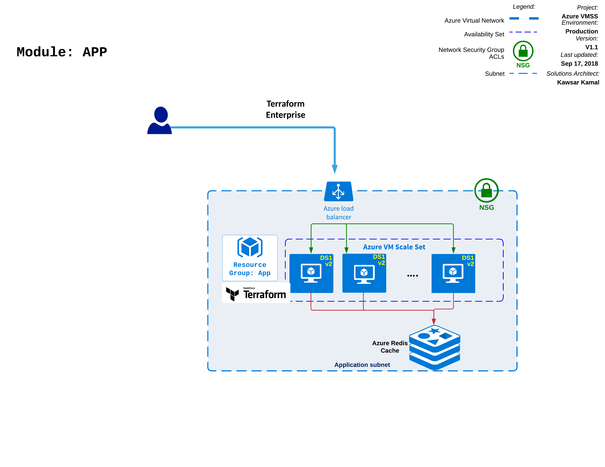
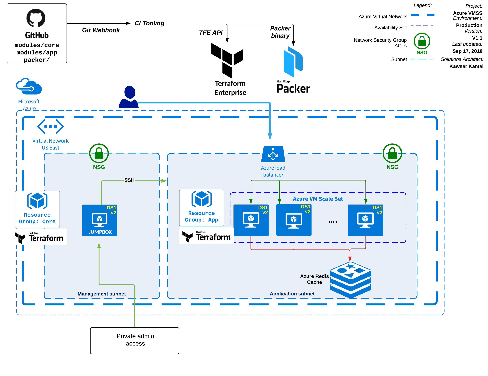

## terraform-azure-vmss-module-app
Terraform App module for use with a Terraform Enterprise Private Module Repository. This module deploys an Azure VM Scale Set, Load Balancer, Azure Redis Cache instance and the [Python Redis Client application](https://github.com/kawsark/redis-client-service/tree/password).
- Dependency:
  - Packer image: A packer image for this application can be provisioned using: [terraform-azure-vmss-packer](https://github.com/kawsark-git-org/terraform-azure-vmss-packer)
  - Core module: [terraform-azure-vmss-module-core](https://github.com/kawsark-git-org/terraform-azure-vmss-module-core)
- Example: see example instantiation in [examples/simple/main.tf](examples/simple/main.tf)

### App Module diagram:

### Terraform Azure VMSS architecture diagram:

